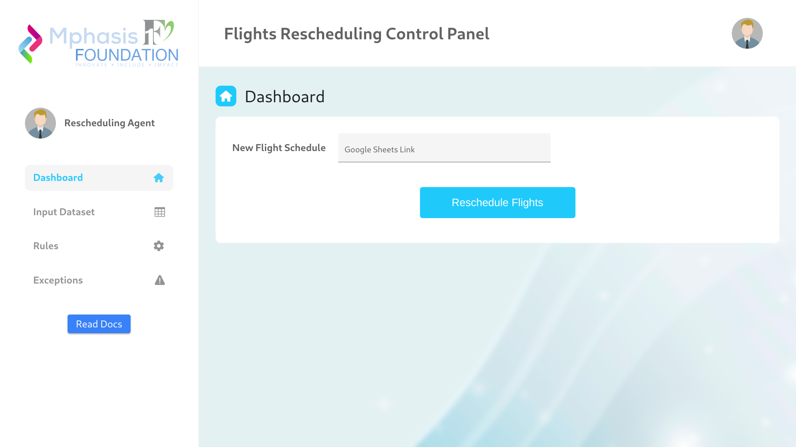
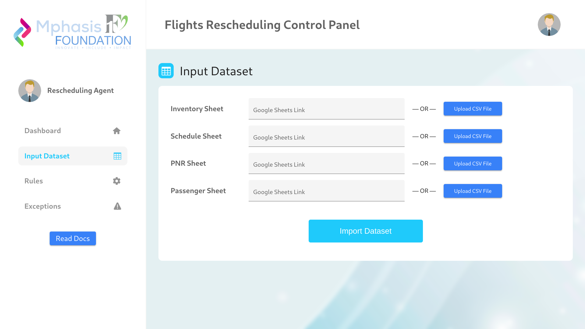
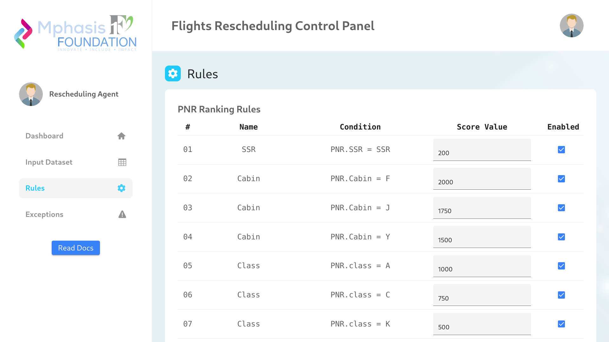

# Mphasis - TEAM Number: 11
Passenger Re-accommodation for a
planned Schedule Change



### Instructions to run the code:
```bash
pip install -r requirements.txt
python server/server.py
```
Then open `localhost:5000` in your browser.

### Algorithm: Priority-Based Passenger Allocation with Dynamic Rule-Based Scoring:

1. **Sort Passengers by Priority:**
   - Prioritize passengers based on factors such as passenger type, loyalty levels, on-duty status, and other relevant criteria. Assign numerical weights to each factor to determine overall priority.

2. **Dynamic Rule-Based Scoring:**
   - Introduce a dynamic rule-based scoring system that computes scores for each passenger based on specific rules. These rules take into account factors like passenger class, loyalty status, and other conditions to dynamically determine the passenger's score.

3. **Segmentation for Targeted Allocation:**
   - Divide the passenger list into segments based on priority levels, considering the dynamically computed scores. Create segments for high-scoring, medium-scoring, and low-scoring passengers.

4. **Homogeneous Distribution within Segments:**
   - Allocate passengers homogeneously within each priority segment. This ensures that high-scoring passengers are distributed across various flights, avoiding concentration on a single flight.

5. **Optimized Flight Utilization:**
   - Utilize an optimization approach to distribute passengers across flights, considering factors such as the capacity of each flight, time to reach the destination, and impact on ancillary services.

6. **Adjustment for Passenger Preferences:**
   - Allow for minor adjustments in allocation to accommodate passenger preferences, such as preferred seating or flight times when possible, within the constraints defined by the optimization model.

7. **Dynamic Update of Priorities:**
   - Implement a dynamic update mechanism for priorities based on real-time factors like passenger check-ins, flight status, and changes in passenger preferences. This ensures adaptability to evolving conditions.

8. **Feedback Mechanism:**
   - Introduce a feedback loop that allows passengers to express their preferences or concerns post-allocation. Use this feedback, along with the dynamically computed scores, to iteratively improve the algorithm and enhance customer satisfaction.

9. **Cancellation Mitigation:**
   - Assign passengers homogeneously to prevent concentration of high-scoring passengers on specific flights. This strategy safeguards against significant disruptions in the event of flight cancellations, ensuring a more resilient re-accommodation process.

### Explanation:

The enhanced algorithm incorporates a dynamic rule-based scoring system to compute individual passenger scores based on specific rules. These rules, which consider factors like passenger class and loyalty status, contribute to a more fine-grained prioritization of passengers. The scoring mechanism is dynamically computed for every allocation, adding adaptability and responsiveness to changing conditions.

**Additional Features:**
- **Dynamic Rule-Based Scoring:** Rules dynamically compute scores for passengers based on various factors, allowing for a nuanced and adaptive prioritization approach.
  
- **Resilience Against Cancellations:** The algorithm's homogeneous allocation strategy, coupled with dynamic scoring, enhances resilience by preventing concentration of high-scoring passengers on specific flights, thereby mitigating the impact of flight cancellations.


### Screenshots:

